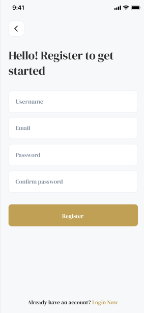
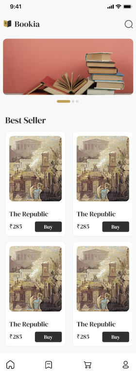
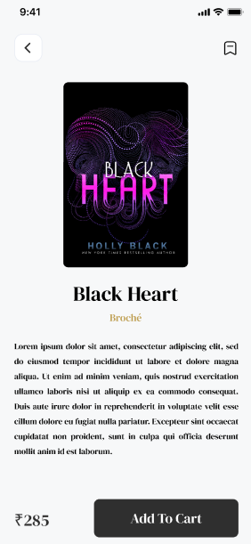
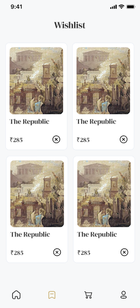

<div align="center">

 

# 📚 Bookia

### *Order Your Book Now!*

A modern, elegant **Flutter** mobile application for browsing and ordering books — featuring a clean UI, smooth navigation, and a seamless shopping experience.

<br/>


</div>

---

## 📱 Screenshots

<div align="center">

| Splash | Welcome | Register |
|--------|---------|----------|
|  |  |  |

| Home | Book Details | Wishlist |
|------|-------------|---------|
|  |  |  |

</div>

---

## ✨ Features

- 🔐 **Authentication** — User registration and login with form validation
- 🏠 **Home Screen** — Featured banner carousel + Best Sellers grid
- 📖 **Book Details** — Full book info with cover, description, price, and Add to Cart
- 🔖 **Wishlist** — Save and manage favorite books
- 🛒 **Cart** — Smooth add-to-cart flow
- 🔍 **Search** — Find books quickly
- 👤 **Profile** — User account management
- 🎨 **Elegant UI** — Warm gold & dark color palette with serif typography

---

## 🏗️ Architecture

This project follows **Clean Architecture** principles with a **feature-based folder structure**:

```
lib/
├── core/
│   ├── network/          # Dio client, API configuration
│   ├── di/               # Dependency injection (GetIt)
│   ├── routing/          # GoRouter navigation
│   └── utils/            # Constants, helpers, themes
│
└── features/
    ├── auth/
    │   ├── data/         # Models, repositories impl, data sources
    │   ├── domain/       # Entities, use cases, repository interfaces
    │   └── presentation/ # BLoC, screens, widgets
    │
    ├── home/
    ├── book_details/
    ├── wishlist/
    └── cart/
```

---

## 🛠️ Tech Stack

| Layer | Technology |
|-------|-----------|
| **UI Framework** | Flutter |
| **Language** | Dart |
| **State Management** | BLoC / Cubit |
| **Dependency Injection** | GetIt |
| **Navigation** | GoRouter |
| **Networking** | Dio |
| **Architecture** | Clean Architecture |

---

## 🚀 Getting Started

### Prerequisites

- Flutter SDK `>=3.0.0`
- Dart SDK `>=3.0.0`

### Installation

```bash
# 1. Clone the repository
git clone https://github.com/ahmed24E/bookia_app.git

# 2. Navigate to the project directory
cd bookia_app

# 3. Install dependencies
flutter pub get

# 4. Run the app
flutter run
```

---

## 📂 Project Structure Highlights

- **BLoC Pattern** for all state management — clean separation of UI and business logic
- **Repository Pattern** — data sources are abstracted behind interfaces
- **Use Cases** — each feature action is encapsulated in a dedicated use case class
- **GetIt** for service locator / dependency injection
- **GoRouter** for declarative, type-safe navigation

---

## 🤝 Contributing

Contributions are welcome! Feel free to open an issue or submit a pull request.

---

## 👨‍💻 Author

**Ahmed** — Flutter Developer

[](https://github.com/ahmed24E)

---

<div align="center">

⭐ If you find this project useful, please consider giving it a star!

</div>